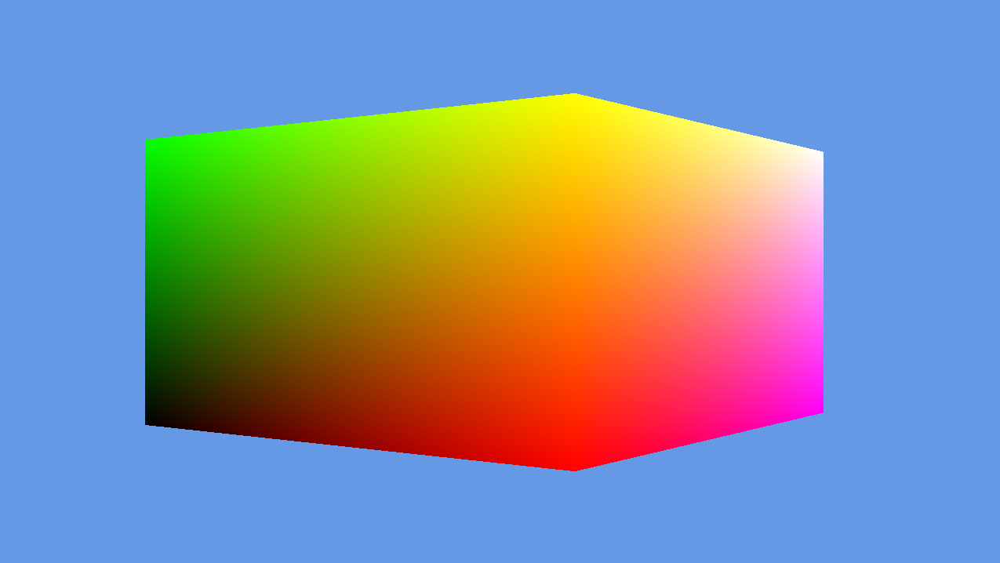

# DirectX 12 Toy Engine

Engine prototype for DX12 experimentation!




## Credit
- [3dgep.com](https://www.3dgep.com/learning-directx-12-1/) tutorials

## Dependencies
CMake LLVM toolchain with Ninja is preferred, you can also use MSVC. Check out `CMakePresets.json`.

## Building
```bash
cmake --preset windows-clang
cmake --build --preset windows-clang-debug
```